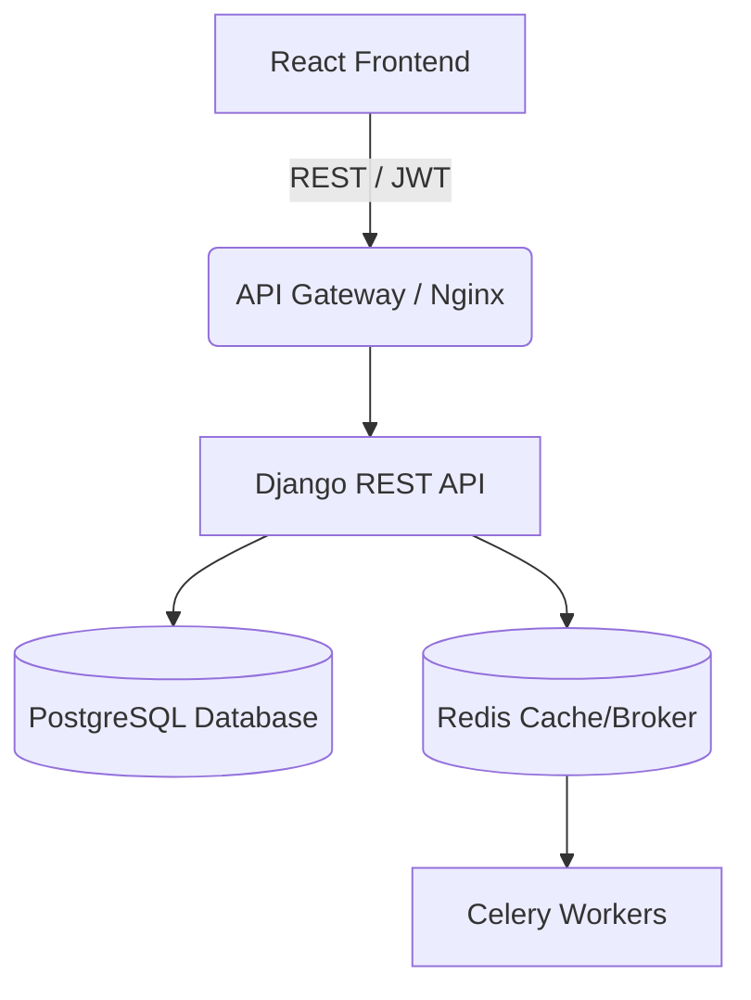
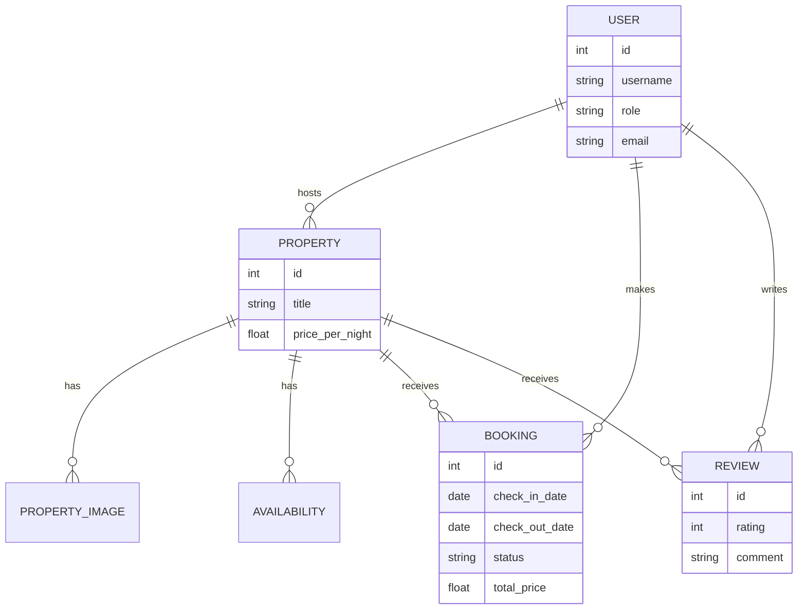

# StayEase - Property Booking Platform

StayEase is a full-stack, production-ready property booking platform inspired by Airbnb. It is built using Django REST Framework for the backend and React (Vite + Tailwind CSS) for the frontend.

# StayEase - Login Page

# StayEase - Dashboard

# StayEase - Homepage


## Features

- **Authentication:** JWT-based login, registration, and role management (Guest vs. Host).
- **Property Listings:** Hosts can list properties, upload images, and manage details.
- **Search & Browse:** Guests can view listings and filter by various criteria.
- **Booking Engine:** Conflict-free booking logic ensuring dates do not overlap.
- **Payment Simulation:** Simulated payment processing to confirm bookings.
- **Dashboards:** Separate views for guests (their trips) and hosts (their listed properties).
- **Reviews:** Guests can leave reviews for properties they have stayed at.

## Tech Stack

**Backend:**
- Django 4.2
- Django REST Framework (DRF)
- djangorestframework-simplejwt (JWT Authentication)
- PostgreSQL (Production ready) / SQLite (Local dev)
- Celery + Redis (Ready for async tasks)

**Frontend:**
- React 18 (Vite)
- Tailwind CSS
- React Router DOM
- Axios
- Lucide React (Icons)

## Setup Instructions

### Local Development (Without Docker)

**Backend:**
```bash
cd backend
python -m venv venv
source venv/bin/activate
pip install -r requirements.txt
python manage.py migrate
python manage.py runserver
```

**Frontend:**
```bash
cd frontend
npm install
npm run dev
```

### Docker Development

You can run the entire application using Docker Compose (Postgres, Redis, Django, React):
```bash
docker-compose up --build
```

## API Endpoints Overview

- **Auth:**
  - `POST /api/users/register/`
  - `POST /api/users/login/`
  - `GET/PUT /api/users/profile/`

- **Properties:**
  - `GET /api/properties/` (List all properties, supports filtering)
  - `POST /api/properties/` (Create property - Host only)
  - `GET /api/properties/{id}/` (Retrieve details)

- **Bookings:**
  - `GET /api/bookings/` (List user's bookings)
  - `POST /api/bookings/` (Create a new booking)
  - `POST /api/bookings/{id}/cancel/` (Cancel booking)

- **Payments:**
  - `POST /api/payments/{booking_id}/pay/` (Simulate payment and confirm booking)

## System Architecture



## Entity Relationship Diagram


